# 📊 SEQUENCE DIAGRAMS - PPE MANAGEMENT

Tài liệu này chứa các sequence diagrams cho các chức năng chính của hệ thống PPE Management.

---

## 1. PHÁT PPE - ADMIN → MANAGER → EMPLOYEE

### 1.1. Admin phát PPE cho Manager

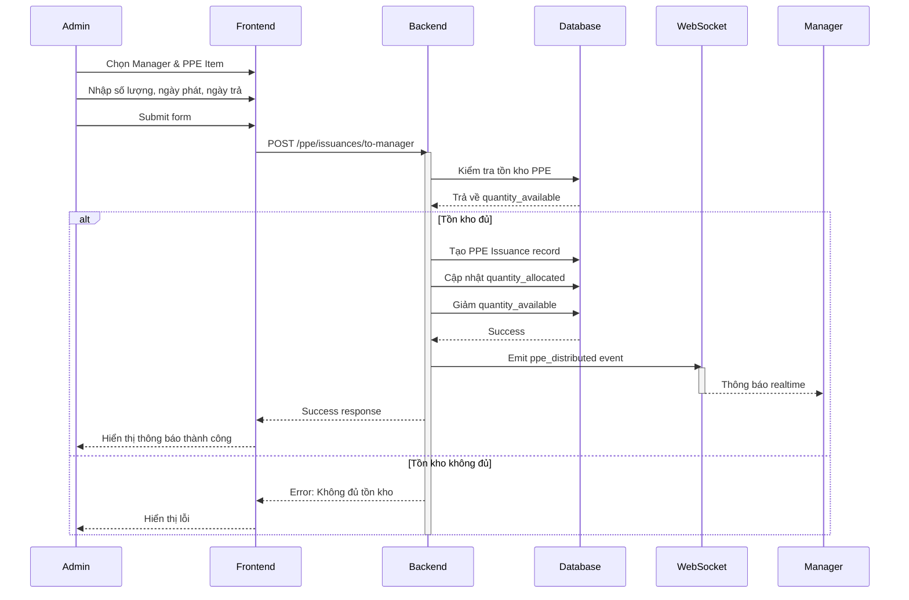
```mermaid
sequenceDiagram
    participant Admin
    participant Frontend
    participant Backend
    participant Database
    participant WebSocket
    participant Manager

    Admin->>Frontend: Chọn Manager & PPE Item
    Admin->>Frontend: Nhập số lượng, ngày phát, ngày trả
    Admin->>Frontend: Submit form
    
    Frontend->>Backend: POST /ppe/issuances/to-manager
    activate Backend
    
    Backend->>Database: Kiểm tra tồn kho PPE
    Database-->>Backend: Trả về quantity_available
    
    alt Tồn kho đủ
        Backend->>Database: Tạo PPE Issuance record
        Backend->>Database: Cập nhật quantity_allocated
        Backend->>Database: Giảm quantity_available
        Database-->>Backend: Success
        
        Backend->>WebSocket: Emit ppe_distributed event
        activate WebSocket
        WebSocket-->>Manager: Thông báo realtime
        deactivate WebSocket
        
        Backend-->>Frontend: Success response
        Frontend-->>Admin: Hiển thị thông báo thành công
    else Tồn kho không đủ
        Backend-->>Frontend: Error: Không đủ tồn kho
        Frontend-->>Admin: Hiển thị lỗi
    end
    
    deactivate Backend
```

### 1.2. Manager phát PPE cho Employee

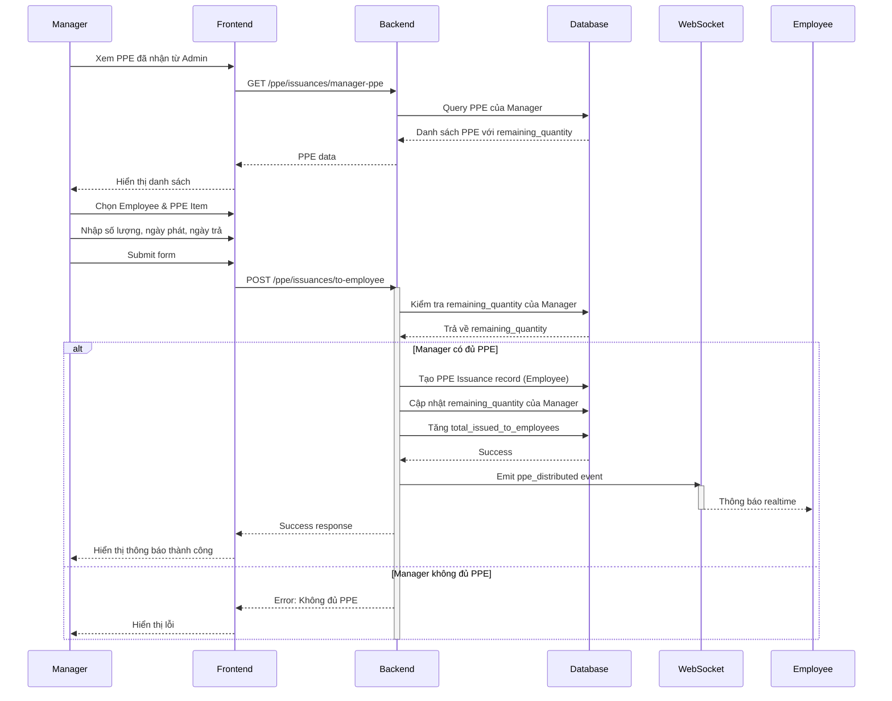
```mermaid
sequenceDiagram
    participant Manager
    participant Frontend
    participant Backend
    participant Database
    participant WebSocket
    participant Employee

    Manager->>Frontend: Xem PPE đã nhận từ Admin
    Frontend->>Backend: GET /ppe/issuances/manager-ppe
    Backend->>Database: Query PPE của Manager
    Database-->>Backend: Danh sách PPE với remaining_quantity
    Backend-->>Frontend: PPE data
    Frontend-->>Manager: Hiển thị danh sách
    
    Manager->>Frontend: Chọn Employee & PPE Item
    Manager->>Frontend: Nhập số lượng, ngày phát, ngày trả
    Manager->>Frontend: Submit form
    
    Frontend->>Backend: POST /ppe/issuances/to-employee
    activate Backend
    
    Backend->>Database: Kiểm tra remaining_quantity của Manager
    Database-->>Backend: Trả về remaining_quantity
    
    alt Manager có đủ PPE
        Backend->>Database: Tạo PPE Issuance record (Employee)
        Backend->>Database: Cập nhật remaining_quantity của Manager
        Backend->>Database: Tăng total_issued_to_employees
        Database-->>Backend: Success
        
        Backend->>WebSocket: Emit ppe_distributed event
        activate WebSocket
        WebSocket-->>Employee: Thông báo realtime
        deactivate WebSocket
        
        Backend-->>Frontend: Success response
        Frontend-->>Manager: Hiển thị thông báo thành công
    else Manager không đủ PPE
        Backend-->>Frontend: Error: Không đủ PPE
        Frontend-->>Manager: Hiển thị lỗi
    end
    
    deactivate Backend
```

---

## 2. TRẢ PPE - EMPLOYEE → MANAGER → ADMIN

### 2.1. Employee trả PPE cho Manager

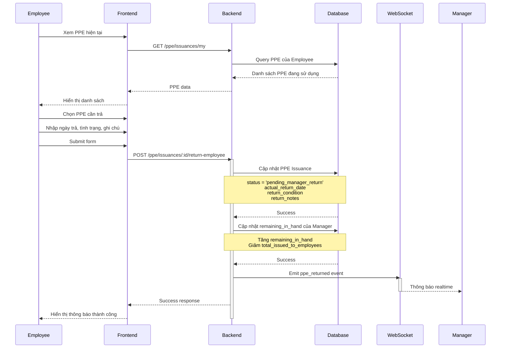
```mermaid
sequenceDiagram
    participant Employee
    participant Frontend
    participant Backend
    participant Database
    participant WebSocket
    participant Manager

    Employee->>Frontend: Xem PPE hiện tại
    Frontend->>Backend: GET /ppe/issuances/my
    Backend->>Database: Query PPE của Employee
    Database-->>Backend: Danh sách PPE đang sử dụng
    Backend-->>Frontend: PPE data
    Frontend-->>Employee: Hiển thị danh sách
    
    Employee->>Frontend: Chọn PPE cần trả
    Employee->>Frontend: Nhập ngày trả, tình trạng, ghi chú
    Employee->>Frontend: Submit form
    
    Frontend->>Backend: POST /ppe/issuances/:id/return-employee
    activate Backend
    
    Backend->>Database: Cập nhật PPE Issuance
    Note over Backend,Database: status = 'pending_manager_return'<br/>actual_return_date<br/>return_condition<br/>return_notes
    Database-->>Backend: Success
    
    Backend->>Database: Cập nhật remaining_in_hand của Manager
    Note over Backend,Database: Tăng remaining_in_hand<br/>Giảm total_issued_to_employees
    Database-->>Backend: Success
    
    Backend->>WebSocket: Emit ppe_returned event
    activate WebSocket
    WebSocket-->>Manager: Thông báo realtime
    deactivate WebSocket
    
    Backend-->>Frontend: Success response
    Frontend-->>Employee: Hiển thị thông báo thành công
    
    deactivate Backend
```

### 2.2. Manager xác nhận nhận PPE từ Employee

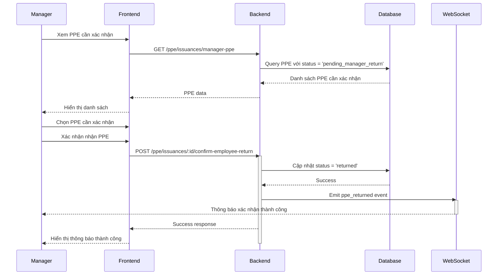
```mermaid
sequenceDiagram
    participant Manager
    participant Frontend
    participant Backend
    participant Database
    participant WebSocket

    Manager->>Frontend: Xem PPE cần xác nhận
    Frontend->>Backend: GET /ppe/issuances/manager-ppe
    Backend->>Database: Query PPE với status = 'pending_manager_return'
    Database-->>Backend: Danh sách PPE cần xác nhận
    Backend-->>Frontend: PPE data
    Frontend-->>Manager: Hiển thị danh sách
    
    Manager->>Frontend: Chọn PPE cần xác nhận
    Manager->>Frontend: Xác nhận nhận PPE
    
    Frontend->>Backend: POST /ppe/issuances/:id/confirm-employee-return
    activate Backend
    
    Backend->>Database: Cập nhật status = 'returned'
    Database-->>Backend: Success
    
    Backend->>WebSocket: Emit ppe_returned event
    activate WebSocket
    WebSocket-->>Manager: Thông báo xác nhận thành công
    deactivate WebSocket
    
    Backend-->>Frontend: Success response
    Frontend-->>Manager: Hiển thị thông báo thành công
    
    deactivate Backend
```

### 2.3. Manager trả PPE về Admin

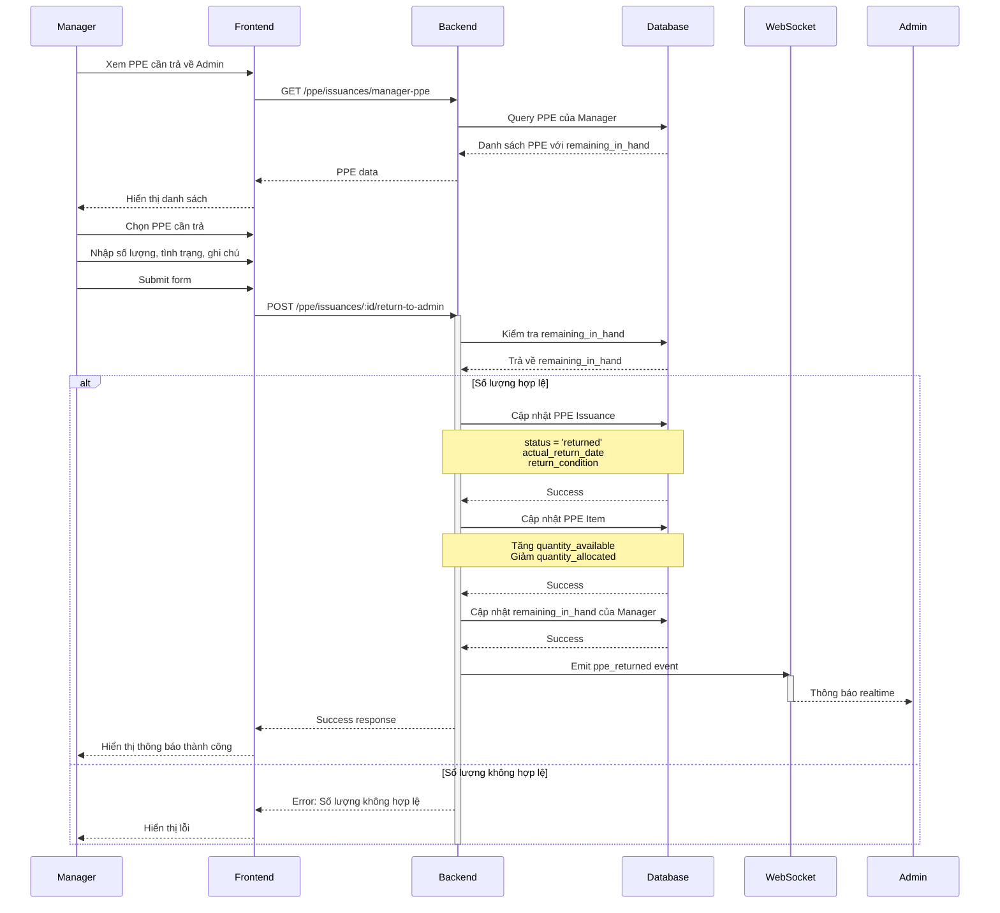
```mermaid
sequenceDiagram
    participant Manager
    participant Frontend
    participant Backend
    participant Database
    participant WebSocket
    participant Admin

    Manager->>Frontend: Xem PPE cần trả về Admin
    Frontend->>Backend: GET /ppe/issuances/manager-ppe
    Backend->>Database: Query PPE của Manager
    Database-->>Backend: Danh sách PPE với remaining_in_hand
    Backend-->>Frontend: PPE data
    Frontend-->>Manager: Hiển thị danh sách
    
    Manager->>Frontend: Chọn PPE cần trả
    Manager->>Frontend: Nhập số lượng, tình trạng, ghi chú
    Manager->>Frontend: Submit form
    
    Frontend->>Backend: POST /ppe/issuances/:id/return-to-admin
    activate Backend
    
    Backend->>Database: Kiểm tra remaining_in_hand
    Database-->>Backend: Trả về remaining_in_hand
    
    alt Số lượng hợp lệ
        Backend->>Database: Cập nhật PPE Issuance
        Note over Backend,Database: status = 'returned'<br/>actual_return_date<br/>return_condition
        Database-->>Backend: Success
        
        Backend->>Database: Cập nhật PPE Item
        Note over Backend,Database: Tăng quantity_available<br/>Giảm quantity_allocated
        Database-->>Backend: Success
        
        Backend->>Database: Cập nhật remaining_in_hand của Manager
        Database-->>Backend: Success
        
        Backend->>WebSocket: Emit ppe_returned event
        activate WebSocket
        WebSocket-->>Admin: Thông báo realtime
        deactivate WebSocket
        
        Backend-->>Frontend: Success response
        Frontend-->>Manager: Hiển thị thông báo thành công
    else Số lượng không hợp lệ
        Backend-->>Frontend: Error: Số lượng không hợp lệ
        Frontend-->>Manager: Hiển thị lỗi
    end
    
    deactivate Backend
```

---

## 3. BÁO CÁO SỰ CỐ PPE

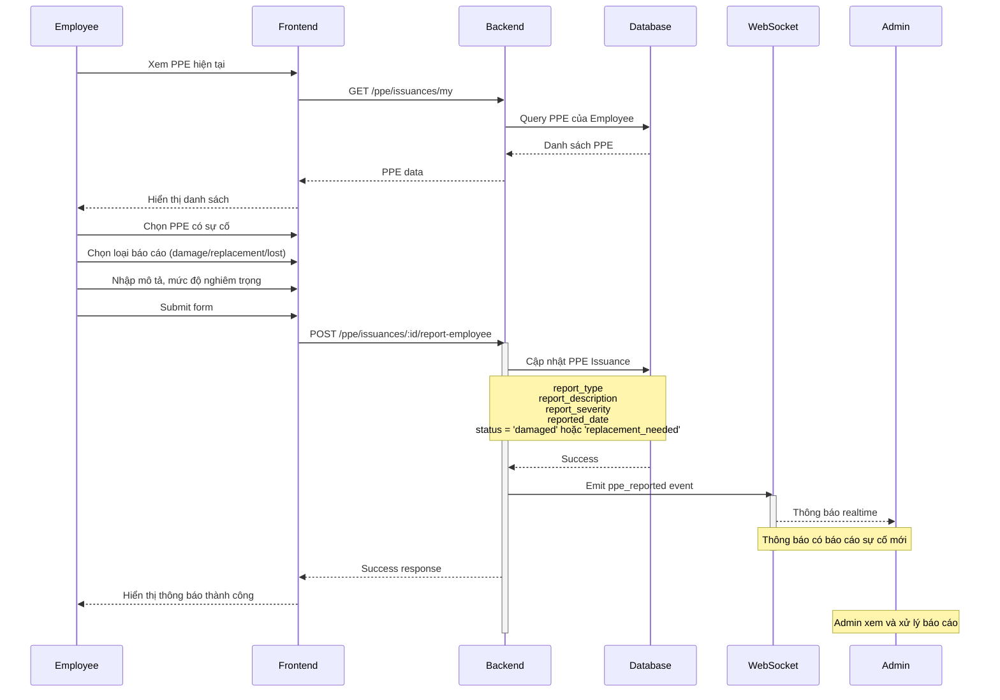
```mermaid
sequenceDiagram
    participant Employee
    participant Frontend
    participant Backend
    participant Database
    participant WebSocket
    participant Admin

    Employee->>Frontend: Xem PPE hiện tại
    Frontend->>Backend: GET /ppe/issuances/my
    Backend->>Database: Query PPE của Employee
    Database-->>Backend: Danh sách PPE
    Backend-->>Frontend: PPE data
    Frontend-->>Employee: Hiển thị danh sách
    
    Employee->>Frontend: Chọn PPE có sự cố
    Employee->>Frontend: Chọn loại báo cáo (damage/replacement/lost)
    Employee->>Frontend: Nhập mô tả, mức độ nghiêm trọng
    Employee->>Frontend: Submit form
    
    Frontend->>Backend: POST /ppe/issuances/:id/report-employee
    activate Backend
    
    Backend->>Database: Cập nhật PPE Issuance
    Note over Backend,Database: report_type<br/>report_description<br/>report_severity<br/>reported_date<br/>status = 'damaged' hoặc 'replacement_needed'
    Database-->>Backend: Success
    
    Backend->>WebSocket: Emit ppe_reported event
    activate WebSocket
    WebSocket-->>Admin: Thông báo realtime
    Note over WebSocket,Admin: Thông báo có báo cáo sự cố mới
    deactivate WebSocket
    
    Backend-->>Frontend: Success response
    Frontend-->>Employee: Hiển thị thông báo thành công
    
    Note over Admin: Admin xem và xử lý báo cáo
    
    deactivate Backend
```

---

## 4. QUẢN LÝ TỒN KHO - CẬP NHẬT SỐ LƯỢNG

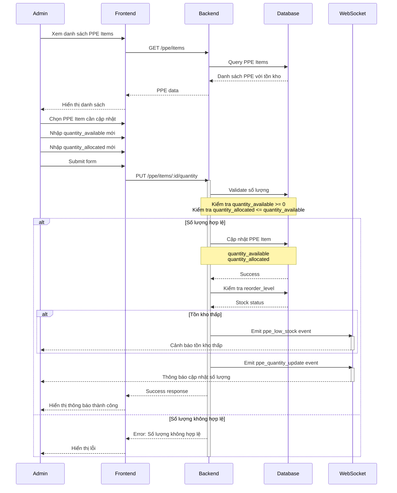
```mermaid
sequenceDiagram
    participant Admin
    participant Frontend
    participant Backend
    participant Database
    participant WebSocket

    Admin->>Frontend: Xem danh sách PPE Items
    Frontend->>Backend: GET /ppe/items
    Backend->>Database: Query PPE Items
    Database-->>Backend: Danh sách PPE với tồn kho
    Backend-->>Frontend: PPE data
    Frontend-->>Admin: Hiển thị danh sách
    
    Admin->>Frontend: Chọn PPE Item cần cập nhật
    Admin->>Frontend: Nhập quantity_available mới
    Admin->>Frontend: Nhập quantity_allocated mới
    Admin->>Frontend: Submit form
    
    Frontend->>Backend: PUT /ppe/items/:id/quantity
    activate Backend
    
    Backend->>Database: Validate số lượng
    Note over Backend,Database: Kiểm tra quantity_available >= 0<br/>Kiểm tra quantity_allocated <= quantity_available
    
    alt Số lượng hợp lệ
        Backend->>Database: Cập nhật PPE Item
        Note over Backend,Database: quantity_available<br/>quantity_allocated
        Database-->>Backend: Success
        
        Backend->>Database: Kiểm tra reorder_level
        Database-->>Backend: Stock status
        
        alt Tồn kho thấp
            Backend->>WebSocket: Emit ppe_low_stock event
            activate WebSocket
            WebSocket-->>Admin: Cảnh báo tồn kho thấp
            deactivate WebSocket
        end
        
        Backend->>WebSocket: Emit ppe_quantity_update event
        activate WebSocket
        WebSocket-->>Admin: Thông báo cập nhật số lượng
        deactivate WebSocket
        
        Backend-->>Frontend: Success response
        Frontend-->>Admin: Hiển thị thông báo thành công
    else Số lượng không hợp lệ
        Backend-->>Frontend: Error: Số lượng không hợp lệ
        Frontend-->>Admin: Hiển thị lỗi
    end
    
    deactivate Backend
```

---

## 5. BATCH ISSUANCE - PHÁT HÀNH HÀNG LOẠT

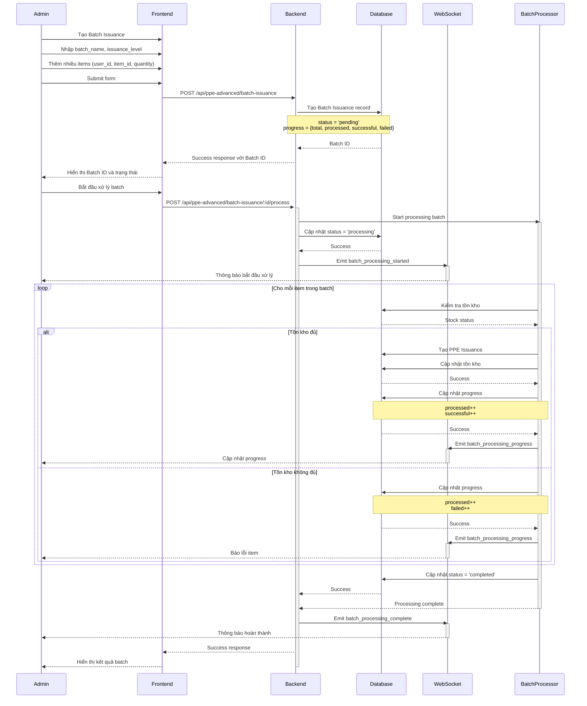
```mermaid
sequenceDiagram
    participant Admin
    participant Frontend
    participant Backend
    participant Database
    participant WebSocket
    participant BatchProcessor

    Admin->>Frontend: Tạo Batch Issuance
    Admin->>Frontend: Nhập batch_name, issuance_level
    Admin->>Frontend: Thêm nhiều items (user_id, item_id, quantity)
    Admin->>Frontend: Submit form
    
    Frontend->>Backend: POST /api/ppe-advanced/batch-issuance
    activate Backend
    
    Backend->>Database: Tạo Batch Issuance record
    Note over Backend,Database: status = 'pending'<br/>progress = {total, processed, successful, failed}
    Database-->>Backend: Batch ID
    
    Backend-->>Frontend: Success response với Batch ID
    Frontend-->>Admin: Hiển thị Batch ID và trạng thái
    
    Admin->>Frontend: Bắt đầu xử lý batch
    Frontend->>Backend: POST /api/ppe-advanced/batch-issuance/:id/process
    activate Backend
    
    Backend->>BatchProcessor: Start processing batch
    activate BatchProcessor
    
    Backend->>Database: Cập nhật status = 'processing'
    Database-->>Backend: Success
    
    Backend->>WebSocket: Emit batch_processing_started
    activate WebSocket
    WebSocket-->>Admin: Thông báo bắt đầu xử lý
    deactivate WebSocket
    
    loop Cho mỗi item trong batch
        BatchProcessor->>Database: Kiểm tra tồn kho
        Database-->>BatchProcessor: Stock status
        
        alt Tồn kho đủ
            BatchProcessor->>Database: Tạo PPE Issuance
            BatchProcessor->>Database: Cập nhật tồn kho
            Database-->>BatchProcessor: Success
            
            BatchProcessor->>Database: Cập nhật progress
            Note over BatchProcessor,Database: processed++<br/>successful++
            Database-->>BatchProcessor: Success
            
            BatchProcessor->>WebSocket: Emit batch_processing_progress
            activate WebSocket
            WebSocket-->>Admin: Cập nhật progress
            deactivate WebSocket
        else Tồn kho không đủ
            BatchProcessor->>Database: Cập nhật progress
            Note over BatchProcessor,Database: processed++<br/>failed++
            Database-->>BatchProcessor: Success
            
            BatchProcessor->>WebSocket: Emit batch_processing_progress
            activate WebSocket
            WebSocket-->>Admin: Báo lỗi item
            deactivate WebSocket
        end
    end
    
    BatchProcessor->>Database: Cập nhật status = 'completed'
    Database-->>Backend: Success
    
    BatchProcessor-->>Backend: Processing complete
    deactivate BatchProcessor
    
    Backend->>WebSocket: Emit batch_processing_complete
    activate WebSocket
    WebSocket-->>Admin: Thông báo hoàn thành
    deactivate WebSocket
    
    Backend-->>Frontend: Success response
    Frontend-->>Admin: Hiển thị kết quả batch
    
    deactivate Backend
```

---

## 6. EXPIRY MANAGEMENT - QUẢN LÝ HẾT HẠN

### 6.1. Tạo Expiry Tracking

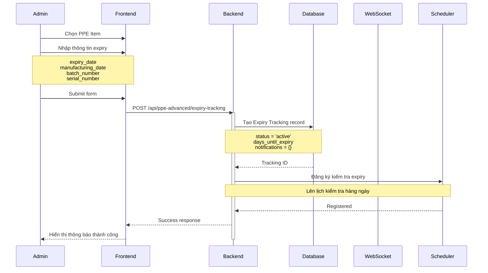
```mermaid
sequenceDiagram
    participant Admin
    participant Frontend
    participant Backend
    participant Database
    participant WebSocket
    participant Scheduler

    Admin->>Frontend: Chọn PPE Item
    Admin->>Frontend: Nhập thông tin expiry
    Note over Admin,Frontend: expiry_date<br/>manufacturing_date<br/>batch_number<br/>serial_number
    Admin->>Frontend: Submit form
    
    Frontend->>Backend: POST /api/ppe-advanced/expiry-tracking
    activate Backend
    
    Backend->>Database: Tạo Expiry Tracking record
    Note over Backend,Database: status = 'active'<br/>days_until_expiry<br/>notifications = {}
    Database-->>Backend: Tracking ID
    
    Backend->>Scheduler: Đăng ký kiểm tra expiry
    Note over Backend,Scheduler: Lên lịch kiểm tra hàng ngày
    Scheduler-->>Backend: Registered
    
    Backend-->>Frontend: Success response
    Frontend-->>Admin: Hiển thị thông báo thành công
    
    deactivate Backend
```

### 6.2. Daily Expiry Check (Tự động)

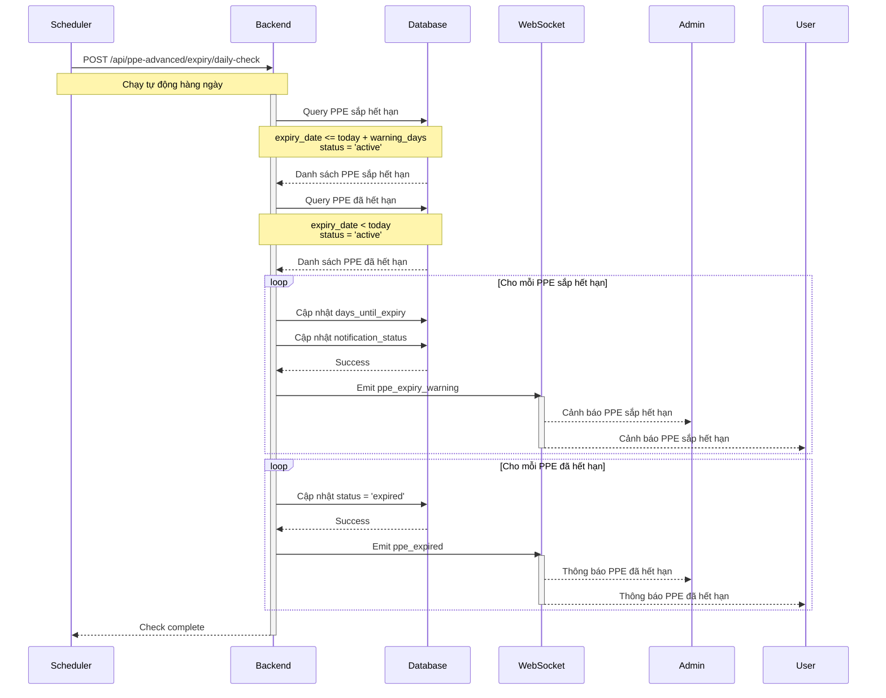
```mermaid
sequenceDiagram
    participant Scheduler
    participant Backend
    participant Database
    participant WebSocket
    participant Admin
    participant User

    Scheduler->>Backend: POST /api/ppe-advanced/expiry/daily-check
    Note over Scheduler,Backend: Chạy tự động hàng ngày
    activate Backend
    
    Backend->>Database: Query PPE sắp hết hạn
    Note over Backend,Database: expiry_date <= today + warning_days<br/>status = 'active'
    Database-->>Backend: Danh sách PPE sắp hết hạn
    
    Backend->>Database: Query PPE đã hết hạn
    Note over Backend,Database: expiry_date < today<br/>status = 'active'
    Database-->>Backend: Danh sách PPE đã hết hạn
    
    loop Cho mỗi PPE sắp hết hạn
        Backend->>Database: Cập nhật days_until_expiry
        Backend->>Database: Cập nhật notification_status
        Database-->>Backend: Success
        
        Backend->>WebSocket: Emit ppe_expiry_warning
        activate WebSocket
        WebSocket-->>Admin: Cảnh báo PPE sắp hết hạn
        WebSocket-->>User: Cảnh báo PPE sắp hết hạn
        deactivate WebSocket
    end
    
    loop Cho mỗi PPE đã hết hạn
        Backend->>Database: Cập nhật status = 'expired'
        Database-->>Backend: Success
        
        Backend->>WebSocket: Emit ppe_expired
        activate WebSocket
        WebSocket-->>Admin: Thông báo PPE đã hết hạn
        WebSocket-->>User: Thông báo PPE đã hết hạn
        deactivate WebSocket
    end
    
    Backend-->>Scheduler: Check complete
    deactivate Backend
```

### 6.3. Thay thế PPE hết hạn

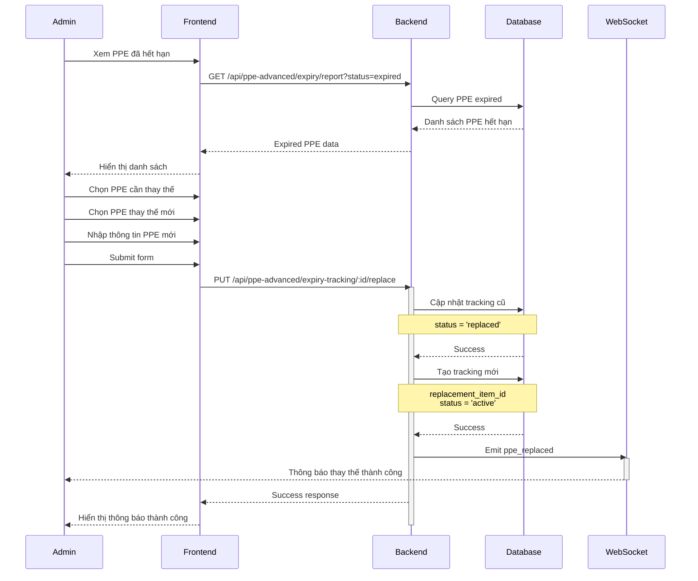
```mermaid
sequenceDiagram
    participant Admin
    participant Frontend
    participant Backend
    participant Database
    participant WebSocket

    Admin->>Frontend: Xem PPE đã hết hạn
    Frontend->>Backend: GET /api/ppe-advanced/expiry/report?status=expired
    Backend->>Database: Query PPE expired
    Database-->>Backend: Danh sách PPE hết hạn
    Backend-->>Frontend: Expired PPE data
    Frontend-->>Admin: Hiển thị danh sách
    
    Admin->>Frontend: Chọn PPE cần thay thế
    Admin->>Frontend: Chọn PPE thay thế mới
    Admin->>Frontend: Nhập thông tin PPE mới
    Admin->>Frontend: Submit form
    
    Frontend->>Backend: PUT /api/ppe-advanced/expiry-tracking/:id/replace
    activate Backend
    
    Backend->>Database: Cập nhật tracking cũ
    Note over Backend,Database: status = 'replaced'
    Database-->>Backend: Success
    
    Backend->>Database: Tạo tracking mới
    Note over Backend,Database: replacement_item_id<br/>status = 'active'
    Database-->>Backend: Success
    
    Backend->>WebSocket: Emit ppe_replaced
    activate WebSocket
    WebSocket-->>Admin: Thông báo thay thế thành công
    deactivate WebSocket
    
    Backend-->>Frontend: Success response
    Frontend-->>Admin: Hiển thị thông báo thành công
    
    deactivate Backend
```

---

## 7. IMPORT CATEGORIES/ITEMS TỪ EXCEL

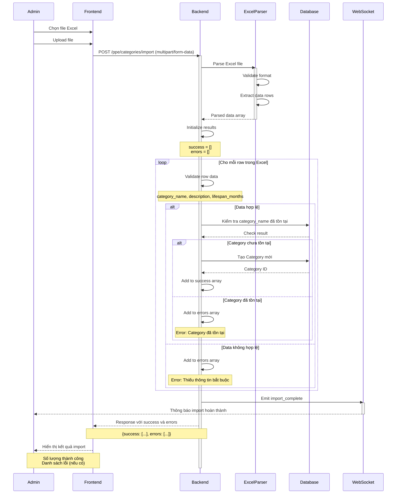
```mermaid
sequenceDiagram
    participant Admin
    participant Frontend
    participant Backend
    participant ExcelParser
    participant Database
    participant WebSocket

    Admin->>Frontend: Chọn file Excel
    Admin->>Frontend: Upload file
    Frontend->>Backend: POST /ppe/categories/import (multipart/form-data)
    activate Backend
    
    Backend->>ExcelParser: Parse Excel file
    activate ExcelParser
    ExcelParser->>ExcelParser: Validate format
    ExcelParser->>ExcelParser: Extract data rows
    ExcelParser-->>Backend: Parsed data array
    deactivate ExcelParser
    
    Backend->>Backend: Initialize results
    Note over Backend: success = []<br/>errors = []
    
    loop Cho mỗi row trong Excel
        Backend->>Backend: Validate row data
        Note over Backend: category_name, description, lifespan_months
        
        alt Data hợp lệ
            Backend->>Database: Kiểm tra category_name đã tồn tại
            Database-->>Backend: Check result
            
            alt Category chưa tồn tại
                Backend->>Database: Tạo Category mới
                Database-->>Backend: Category ID
                Backend->>Backend: Add to success array
            else Category đã tồn tại
                Backend->>Backend: Add to errors array
                Note over Backend: Error: Category đã tồn tại
            end
        else Data không hợp lệ
            Backend->>Backend: Add to errors array
            Note over Backend: Error: Thiếu thông tin bắt buộc
        end
    end
    
    Backend->>WebSocket: Emit import_complete
    activate WebSocket
    WebSocket-->>Admin: Thông báo import hoàn thành
    deactivate WebSocket
    
    Backend-->>Frontend: Response với success và errors
    Note over Backend,Frontend: {success: [...], errors: [...]}
    Frontend-->>Admin: Hiển thị kết quả import
    Note over Frontend,Admin: Số lượng thành công<br/>Danh sách lỗi (nếu có)
    
    deactivate Backend
```

---

## 8. OPTIMISTIC LOCKING - CẬP NHẬT SỐ LƯỢNG VỚI VERSION CONTROL

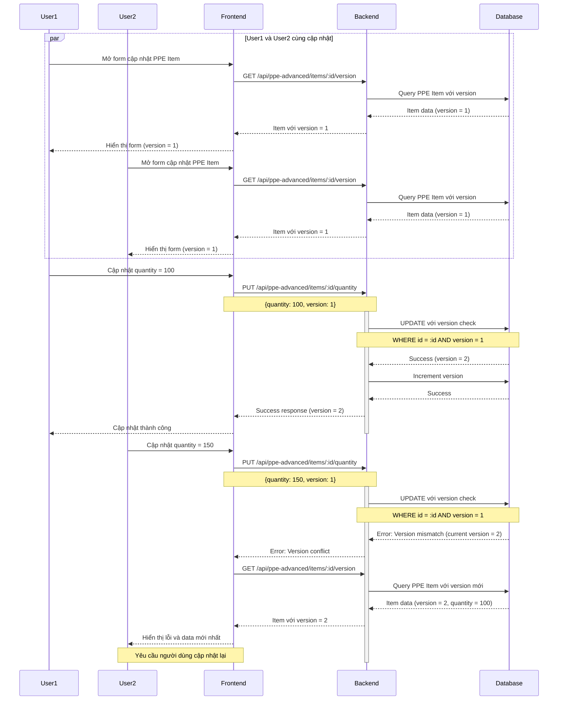
```mermaid
sequenceDiagram
    participant User1
    participant User2
    participant Frontend
    participant Backend
    participant Database

    par User1 và User2 cùng cập nhật
        User1->>Frontend: Mở form cập nhật PPE Item
        Frontend->>Backend: GET /api/ppe-advanced/items/:id/version
        Backend->>Database: Query PPE Item với version
        Database-->>Backend: Item data (version = 1)
        Backend-->>Frontend: Item với version = 1
        Frontend-->>User1: Hiển thị form (version = 1)
        
        User2->>Frontend: Mở form cập nhật PPE Item
        Frontend->>Backend: GET /api/ppe-advanced/items/:id/version
        Backend->>Database: Query PPE Item với version
        Database-->>Backend: Item data (version = 1)
        Backend-->>Frontend: Item với version = 1
        Frontend-->>User2: Hiển thị form (version = 1)
    end
    
    User1->>Frontend: Cập nhật quantity = 100
    Frontend->>Backend: PUT /api/ppe-advanced/items/:id/quantity
    Note over Frontend,Backend: {quantity: 100, version: 1}
    activate Backend
    
    Backend->>Database: UPDATE với version check
    Note over Backend,Database: WHERE id = :id AND version = 1
    Database-->>Backend: Success (version = 2)
    
    Backend->>Database: Increment version
    Database-->>Backend: Success
    Backend-->>Frontend: Success response (version = 2)
    Frontend-->>User1: Cập nhật thành công
    
    deactivate Backend
    
    User2->>Frontend: Cập nhật quantity = 150
    Frontend->>Backend: PUT /api/ppe-advanced/items/:id/quantity
    Note over Frontend,Backend: {quantity: 150, version: 1}
    activate Backend
    
    Backend->>Database: UPDATE với version check
    Note over Backend,Database: WHERE id = :id AND version = 1
    Database-->>Backend: Error: Version mismatch (current version = 2)
    
    Backend-->>Frontend: Error: Version conflict
    Frontend->>Backend: GET /api/ppe-advanced/items/:id/version
    Backend->>Database: Query PPE Item với version mới
    Database-->>Backend: Item data (version = 2, quantity = 100)
    Backend-->>Frontend: Item với version = 2
    Frontend-->>User2: Hiển thị lỗi và data mới nhất
    Note over Frontend,User2: Yêu cầu người dùng cập nhật lại
    deactivate Backend
```

---

## 9. THỐNG KÊ VÀ BÁO CÁO

### 9.1. Lấy Dashboard Statistics

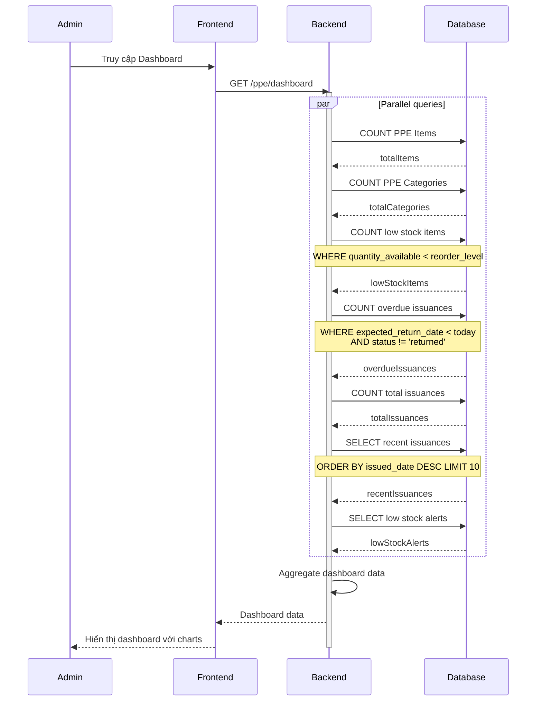
```mermaid
sequenceDiagram
    participant Admin
    participant Frontend
    participant Backend
    participant Database

    Admin->>Frontend: Truy cập Dashboard
    Frontend->>Backend: GET /ppe/dashboard
    activate Backend
    
    par Parallel queries
        Backend->>Database: COUNT PPE Items
        Database-->>Backend: totalItems
        
        Backend->>Database: COUNT PPE Categories
        Database-->>Backend: totalCategories
        
        Backend->>Database: COUNT low stock items
        Note over Backend,Database: WHERE quantity_available < reorder_level
        Database-->>Backend: lowStockItems
        
        Backend->>Database: COUNT overdue issuances
        Note over Backend,Database: WHERE expected_return_date < today<br/>AND status != 'returned'
        Database-->>Backend: overdueIssuances
        
        Backend->>Database: COUNT total issuances
        Database-->>Backend: totalIssuances
        
        Backend->>Database: SELECT recent issuances
        Note over Backend,Database: ORDER BY issued_date DESC LIMIT 10
        Database-->>Backend: recentIssuances
        
        Backend->>Database: SELECT low stock alerts
        Database-->>Backend: lowStockAlerts
    end
    
    Backend->>Backend: Aggregate dashboard data
    Backend-->>Frontend: Dashboard data
    Frontend-->>Admin: Hiển thị dashboard với charts
    
    deactivate Backend
```

### 9.2. Generate PDF Report

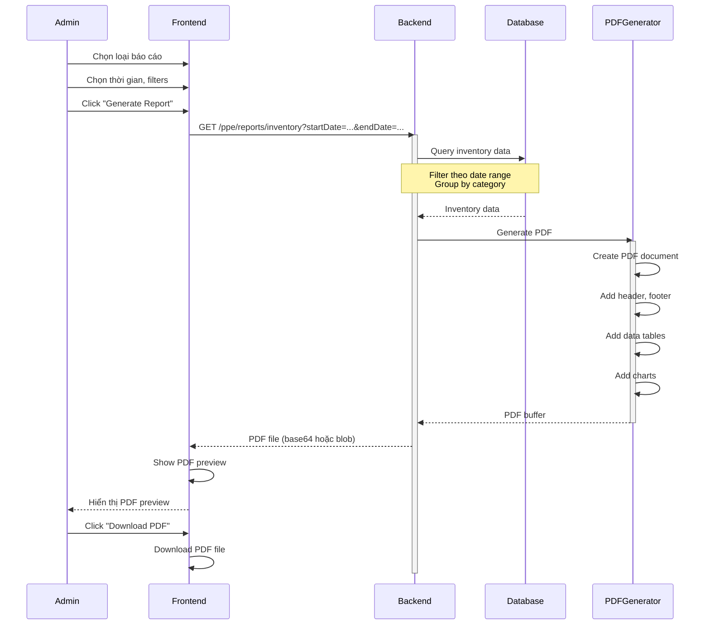
```mermaid
sequenceDiagram
    participant Admin
    participant Frontend
    participant Backend
    participant Database
    participant PDFGenerator

    Admin->>Frontend: Chọn loại báo cáo
    Admin->>Frontend: Chọn thời gian, filters
    Admin->>Frontend: Click "Generate Report"
    
    Frontend->>Backend: GET /ppe/reports/inventory?startDate=...&endDate=...
    activate Backend
    
    Backend->>Database: Query inventory data
    Note over Backend,Database: Filter theo date range<br/>Group by category
    Database-->>Backend: Inventory data
    
    Backend->>PDFGenerator: Generate PDF
    activate PDFGenerator
    PDFGenerator->>PDFGenerator: Create PDF document
    PDFGenerator->>PDFGenerator: Add header, footer
    PDFGenerator->>PDFGenerator: Add data tables
    PDFGenerator->>PDFGenerator: Add charts
    PDFGenerator-->>Backend: PDF buffer
    deactivate PDFGenerator
    
    Backend-->>Frontend: PDF file (base64 hoặc blob)
    Frontend->>Frontend: Show PDF preview
    Frontend-->>Admin: Hiển thị PDF preview
    
    Admin->>Frontend: Click "Download PDF"
    Frontend->>Frontend: Download PDF file
    
    deactivate Backend
```

---

## 10. WEBSOCKET REALTIME NOTIFICATIONS

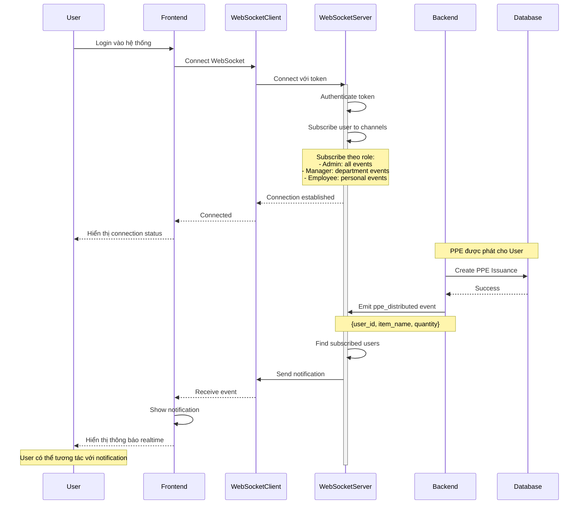
```mermaid
sequenceDiagram
    participant User
    participant Frontend
    participant WebSocketClient
    participant WebSocketServer
    participant Backend
    participant Database

    User->>Frontend: Login vào hệ thống
    Frontend->>WebSocketClient: Connect WebSocket
    WebSocketClient->>WebSocketServer: Connect với token
    activate WebSocketServer
    
    WebSocketServer->>WebSocketServer: Authenticate token
    WebSocketServer->>WebSocketServer: Subscribe user to channels
    Note over WebSocketServer: Subscribe theo role:<br/>- Admin: all events<br/>- Manager: department events<br/>- Employee: personal events
    
    WebSocketServer-->>WebSocketClient: Connection established
    WebSocketClient-->>Frontend: Connected
    Frontend-->>User: Hiển thị connection status
    
    Note over Backend,Database: PPE được phát cho User
    
    Backend->>Database: Create PPE Issuance
    Database-->>Backend: Success
    
    Backend->>WebSocketServer: Emit ppe_distributed event
    Note over Backend,WebSocketServer: {user_id, item_name, quantity}
    
    WebSocketServer->>WebSocketServer: Find subscribed users
    WebSocketServer->>WebSocketClient: Send notification
    WebSocketClient-->>Frontend: Receive event
    Frontend->>Frontend: Show notification
    Frontend-->>User: Hiển thị thông báo realtime
    
    Note over User: User có thể tương tác với notification
    
    deactivate WebSocketServer
```

---

## 11. TÌM KIẾM VÀ LỌC PPE ITEMS

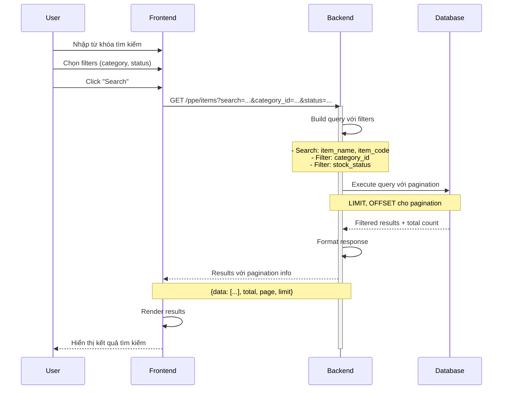
```mermaid
sequenceDiagram
    participant User
    participant Frontend
    participant Backend
    participant Database

    User->>Frontend: Nhập từ khóa tìm kiếm
    User->>Frontend: Chọn filters (category, status)
    User->>Frontend: Click "Search"
    
    Frontend->>Backend: GET /ppe/items?search=...&category_id=...&status=...
    activate Backend
    
    Backend->>Backend: Build query với filters
    Note over Backend: - Search: item_name, item_code<br/>- Filter: category_id<br/>- Filter: stock_status
    
    Backend->>Database: Execute query với pagination
    Note over Backend,Database: LIMIT, OFFSET cho pagination
    Database-->>Backend: Filtered results + total count
    
    Backend->>Backend: Format response
    Backend-->>Frontend: Results với pagination info
    Note over Backend,Frontend: {data: [...], total, page, limit}
    
    Frontend->>Frontend: Render results
    Frontend-->>User: Hiển thị kết quả tìm kiếm
    
    deactivate Backend
```

---

## 📝 GHI CHÚ

### Ký hiệu trong diagrams:
- **Nét liền (->)**: Synchronous call (đồng bộ)
- **Nét đứt (-->>)**: Asynchronous call (bất đồng bộ) hoặc response
- **activate/deactivate**: Thời gian hoạt động của component
- **alt/else**: Điều kiện if/else
- **loop**: Vòng lặp
- **par**: Parallel execution (song song)
- **Note**: Ghi chú giải thích

### Cách sử dụng:
1. Copy code Mermaid vào file `.md` hoặc sử dụng trong các công cụ hỗ trợ Mermaid
2. Có thể sử dụng trong:
   - GitHub/GitLab (hỗ trợ Mermaid)
   - VS Code với extension Mermaid Preview
   - Online: https://mermaid.live/
   - Notion, Confluence (có plugin)

### PlantUML Alternative:
Nếu cần PlantUML thay vì Mermaid, có thể convert hoặc tôi có thể tạo version PlantUML riêng.

